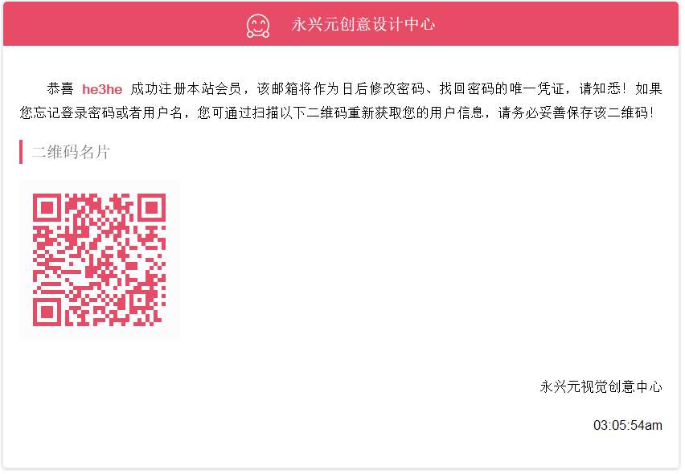

# api
laravel版本api
## 用户注册
用户注册分为通过邮箱和手机注册，请求的api接口分别如下：

提示：localhost会随着服务器地址而变！
### 邮箱
[http://localhost/api/public/register/email?email=1543785@qq.com&username=he3he&password=122514](http://localhost/api/public/register/email?email=1543785@qq.com&username=he3he&password=122514)

param详解：

email:可用的email邮箱地址

username: 您要注册的用户名

password: 账户的密码

#### 成功返回：
``` json
{
  "status": 1,
  "msg": "注册成功！",
  "data": {
    "uId": "f4734ed4fada0bc6ab5ae82b877ae256",
    "email": "1543785@qq.com",
    "username": "he3he",
    "updated_at": "2017-12-28 03:05:54",
    "created_at": "2017-12-28 03:05:54",
    "id": 21
  },
  "mail": null
}
```
同时，通过邮箱注册的用户，会自动向您所填写的邮箱发送一封邮件，里面包含您所注册一些重要信息，请妥善保存该邮件，但凡有涉及到账户重大操作的都会发送该邮件！
#### 邮件预览

扫描下方二维码可以获得您所注册的用户名，密码以及邮箱或者手机号等信息！请勿提供给他人！

### 手机

[http://localhost/api/public/register/phone?phone=18827078587&username=swimly&password=122514](http://localhost/api/public/register/phone?phone=18827078587&username=swimly&password=122514)
手机注册暂时没有做发送验证码操作，直接就可注册成功，没有任何确认信息，这个以后有待解决

param详解：

phone: 您的手机号码

username: 您要注册的用户名

password: 账户的密码

#### 成功返回
``` json
{
  "status": 1,
  "msg": "注册成功！",
  "data": {
    "uId": "c2a005bb77d0267068c03ebc5c3193fd",
    "phone": "18827078587",
    "username": "swimly",
    "updated_at": "2017-12-28 03:14:59",
    "created_at": "2017-12-28 03:14:59",
    "id": 22
  },
  "mail": null
}
```
## 发送短信验证码接口：
[http://192.168.3.214/api/public/sms/{phone}?type=0](http://192.168.3.214/api/public/sms/)

参数说明：
phone：要接收验证码的手机号

type：可选值（0：用户注册；1：修改密码；2：修改手机号）

成功示例：
``` json
{
  "status": 1,
  "msg": "验证码发送成功！",
  "code": 740914
}
```